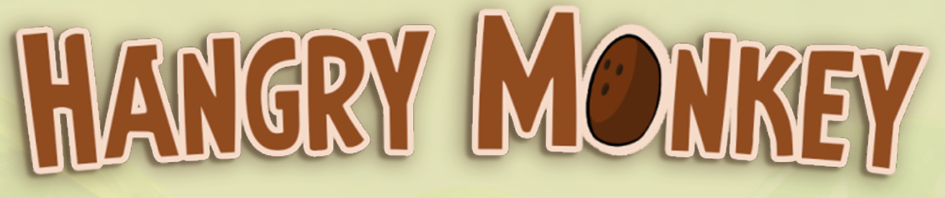
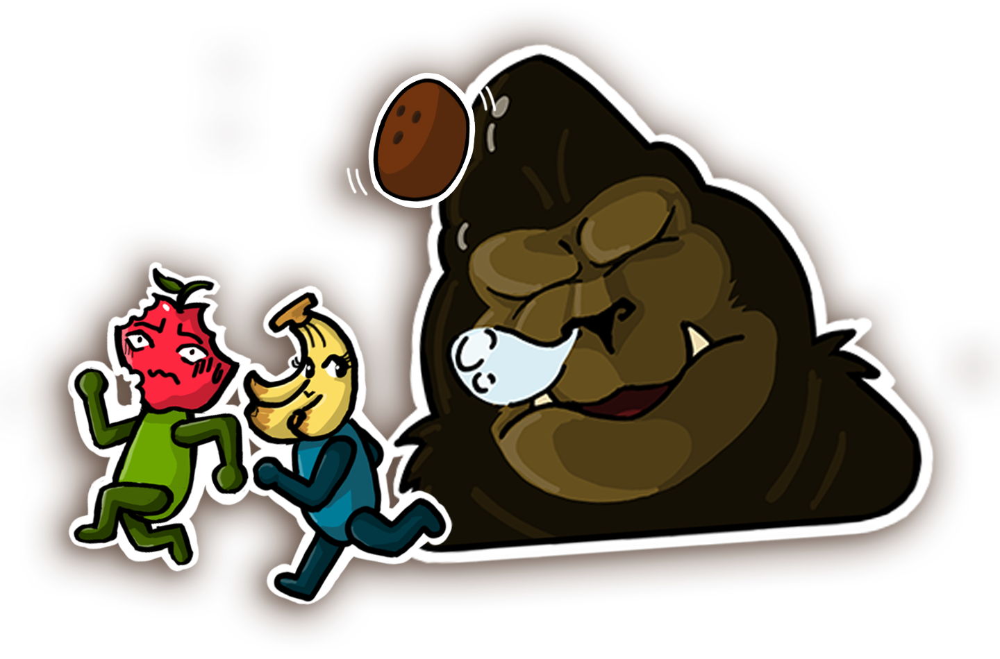
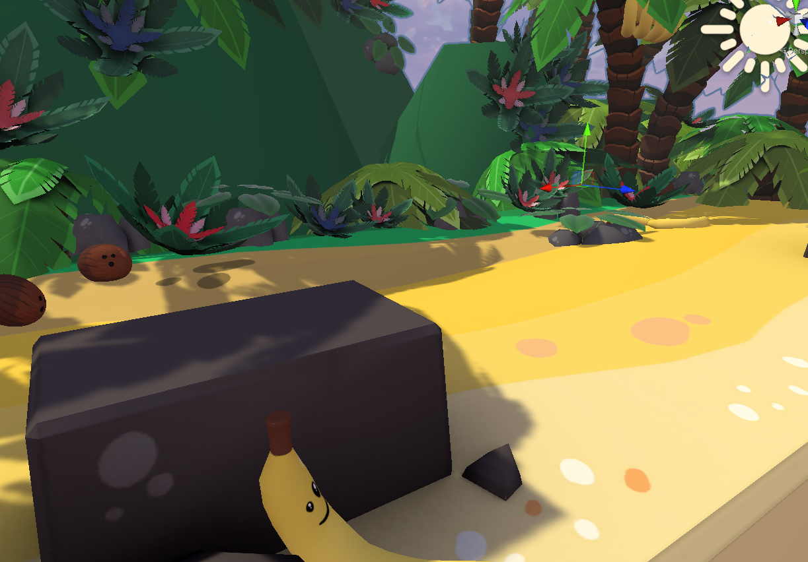
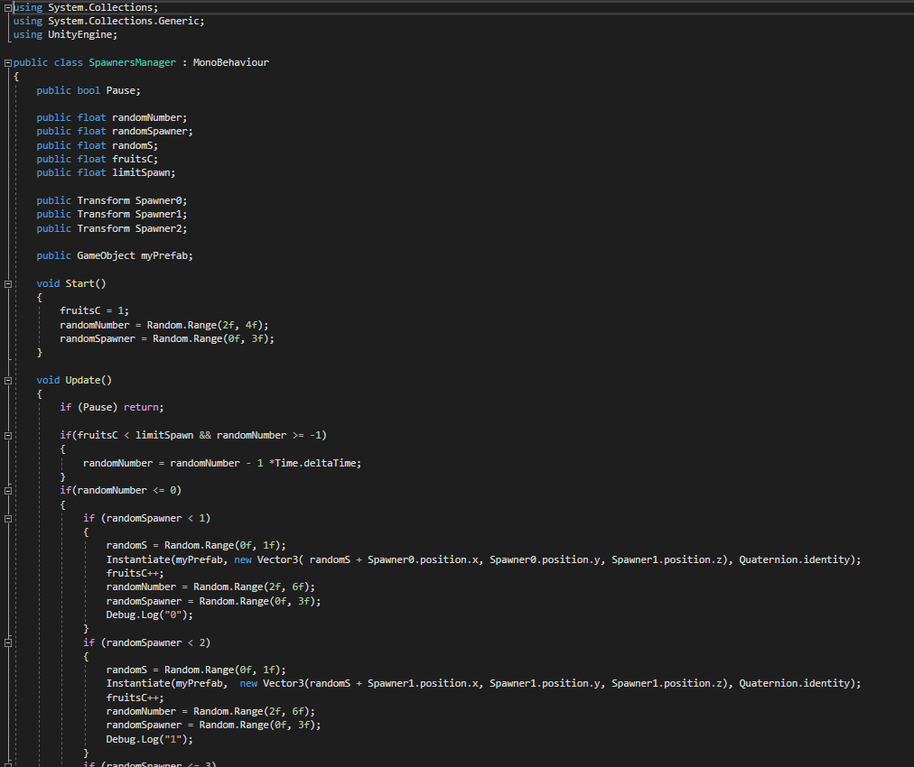

# HangryMonkey

HANGRY MONKEY !

Winning game of the Game Jam ETPA (Toulouse / Rennes / Montpellier) 2022

The jam's theme was : War and Peace.

Local multiplayer - 1 VS 1

You were once a peaceful apple traveling on a boat.

But your journey came to an end the day the boat sank, leaving you in unknown territory.

Now, you're stuck with a local banana on a strange island. Not knowing its intentions, you immediately start to fight, under the watch of a ginormous monkey - who seems really hangry.

Use the innocent coconuts you find on the beach to hit your enemy, but don't forget to feed the gorilla, or you might end in his stomach instead of the coconuts...

Video of the game :
https://youtu.be/5wBDeJlw7uA?t=8

Try out the game [here](https://loudebwa.itch.io/espace-temps) 

During this project we were tow developers Edouard Mordant was in charge 
of the creation of the character controler for the local multiplayer 1v1

and i did the rest of the mechanics for exemple the procedural generate items
the monkey that slaps the 2 players the game over the change scene and the menus

the code in this project is very simple bit for exemple this is one pert of 
the code that served to create the procural generated coconuts (the weapons in the game)

A Cubi© production :

Edouard Mordant (Lead - Dev)
Francisco De Carvalho Pereira (Dev - VFX)
Romane Schreck (Artistic Direction- 2D - Animation)
Sami Delvallée (Artistic Direction- 3D - SFX)
Eve Cabanié (Artistic Direction- UI - Texturing)
